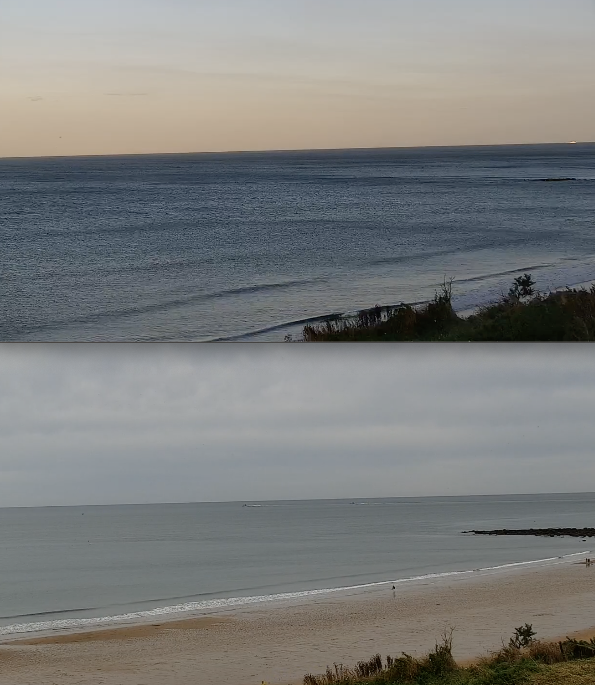
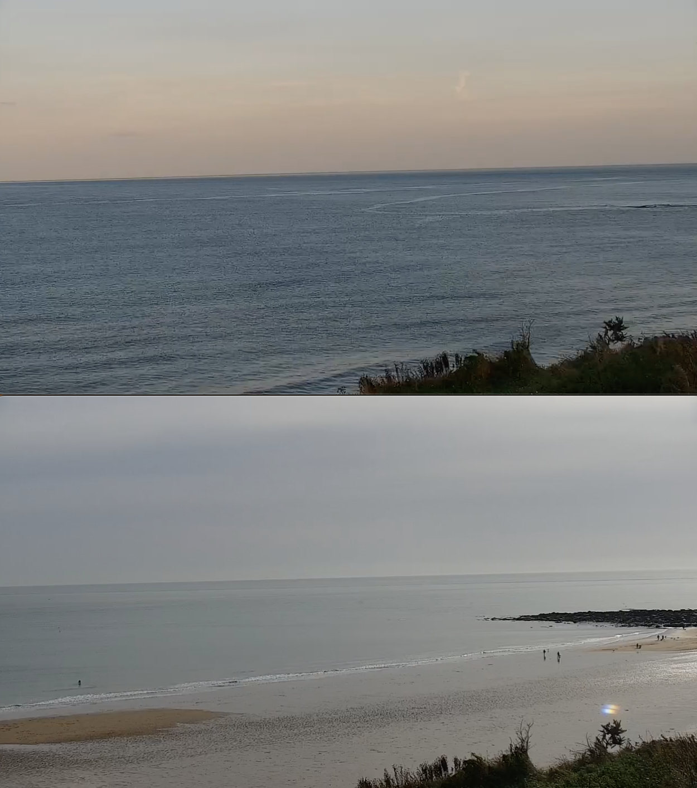
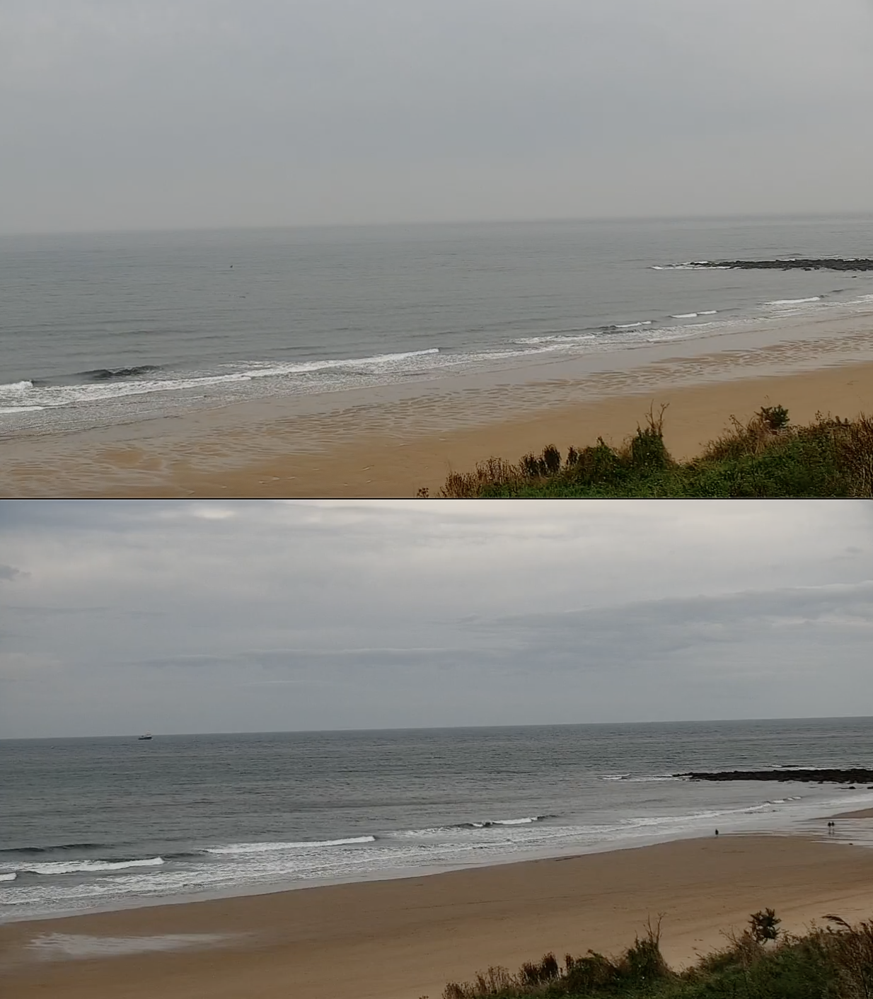
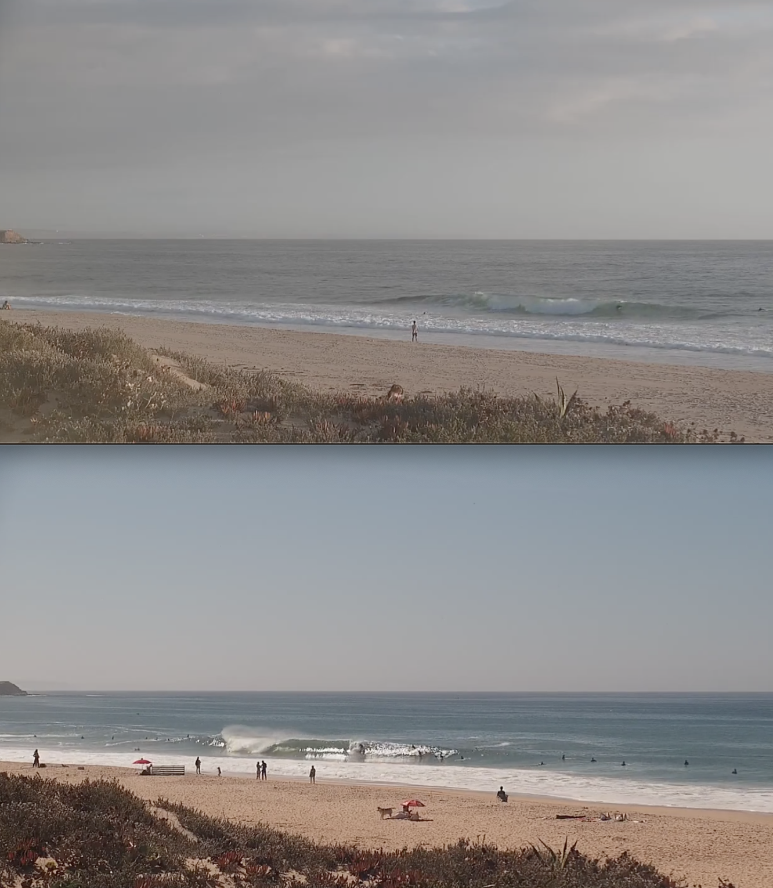
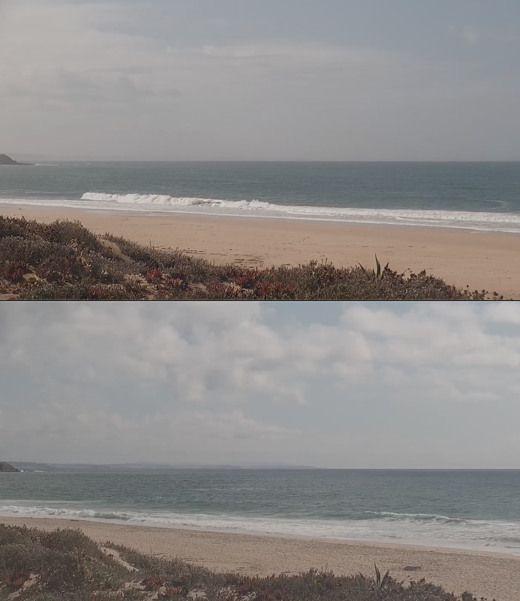

# Time Machine Surf Cam

This builds on the dataset created with [surf-forecast-videos](https://github.com/jreaso/surf-forecast-videos). This project is not complete and is currently using a nearest neighbour approach with the assumption that key features of a surf report are (_equally_) important. Forecasts are clustered by their similarities on these key features so that forecast footage can be shown. In the current state, there is no success metric defined and this will be key to building a usable model.

Note that this is built on top of the 04/10/23 version of the dataset which contains approximately a month worth of observations and is by no means large enough to provide desirable result.

Improvements could be to label the videos either by attaching tags (_e.g. flat, messy, clean, shoulder high, ..._) or by ranking how similar a subset of pairs are. These would both result in a better idea about which features are more influential on the surf.

## Evaluation

Below are 5 random comparisons of the forecast's video and the nearest neighbor's video (both different days). It appears that it has at least worked reasonable, but we do not yet have the mechanisms to measure it's efficacy. It also appears that there may be a lot of relatively flat days in the dataset.

### Comparison A

### Comparison B

### Comparison C

### Comparison D

### Comparison E

